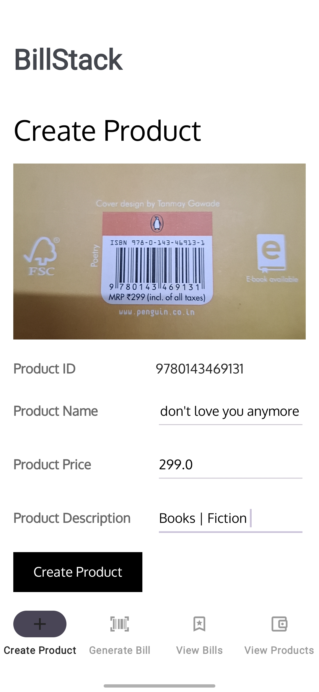
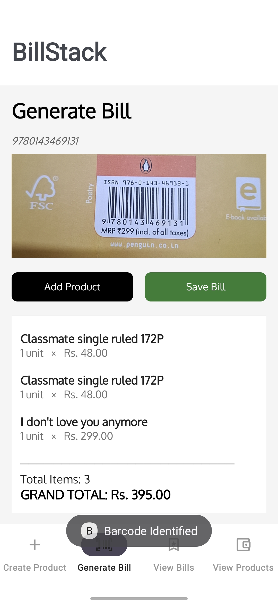
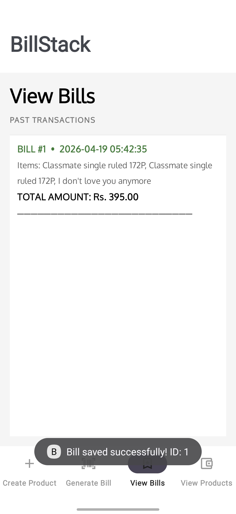
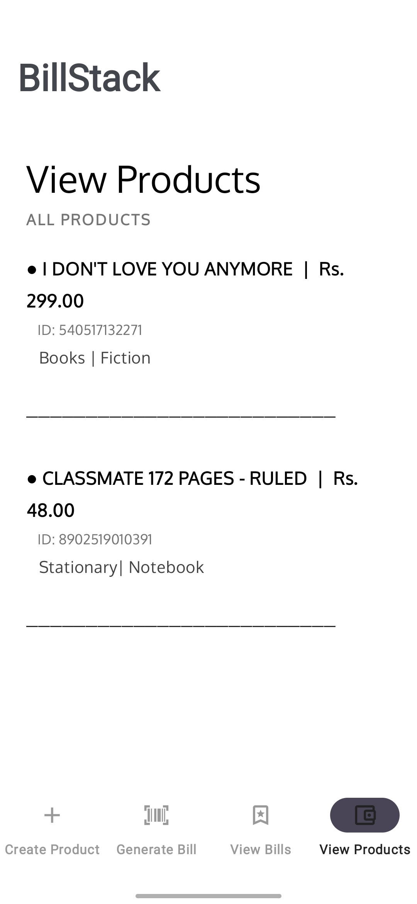

# BillStack: Enterprise-Grade Barcode Billing Solution

BillStack is an advanced Android-based Point-of-Sale (POS) application engineered to optimize inventory management and billing workflows for small-to-medium scale retailers. By integrating computer vision with a robust offline-first architecture, the system mitigates manual entry errors and accelerates transaction throughput.

### Demo: https://www.youtube.com/watch?v=mgRs5nfLK6k
 
---

## Platform View
### 1. Create Product


### 2. Generate Bills


### 3. View Bills


### 4. View Products


---

## 1. Technical Architecture

The application is built on the **MVVM (Model-View-ViewModel)** design pattern, ensuring a strict separation of concerns, high maintainability, and testability.

* **Presentation Layer:** Implemented using **View Binding** and **ConstraintLayout** for high-performance UI rendering and type-safe view access.
* **Logic Layer:** ViewModels manage state and interact with data sources, ensuring UI persistence across configuration changes.
* **Data Layer:** Utilizes a **Repository Pattern** to abstract database operations.
* **Hardware Integration:** Leverages the **CameraX Jetpack library** combined with **Google ML Kit** for hardware-accelerated image analysis.

---

## 2. Technology Stack

| Component | Specification |
| :--- | :--- |
| **Language** | Kotlin 1.8+ |
| **Minimum SDK** | API 24 (Android 7.0) |
| **Computer Vision** | Google ML Kit (Barcode Scanning SDK) |
| **Camera Framework** | CameraX (Lifecycle-aware) |
| **Database** | SQLite / Room Persistence Library |
| **UI Paradigm** | XML (Monochrome Optimized) with Haptic Integration |

---

## 3. Core Functional Modules

### 3.1 Computer Vision & Analysis
The system employs a custom `BarcodeAnalyzer` class implementing the `ImageAnalysis.Analyzer` interface.
* **Temporal Debouncing:** Implements a logical cool-down period between scans to prevent redundant database queries.
* **Lifecycle Awareness:** Analysis is bound to the `viewLifecycleOwner`, preventing memory leaks and ensuring resources are released when the fragment is detached.

### 3.2 Automated Billing Engine
* **Session Management:** Maintains a volatile `ArrayList<Product>` for real-time cart manipulation.
* **Dynamic Computation:** Automatically calculates sub-totals and grand totals using `StringBuilder` for scannable, receipt-style previews.
* **Haptic Interface:** Utilizes `performHapticFeedback` with `CONFIRM` constants to provide tactile verification of successful scans, enhancing operational speed in loud environments.

### 3.3 Product & Inventory Management
* **Persistence:** Local SQLite storage ensures zero-latency access to product records.
* **Data Integrity:** Implements primary key constraints on Barcode IDs to prevent duplicate inventory entries.

---

## 4. Database Design

### Table: `Product`
| Attribute | Data Type | Constraint |
| :--- | :--- | :--- |
| `id` | TEXT(25) | PRIMARY KEY |
| `name` | TEXT | NOT NULL |
| `price` | DOUBLE | DEFAULT 0.0 |
| `description` | TEXT | NULLABLE |

### Table: `Bills`
| Attribute | Data Type | Constraint |
| :--- | :--- | :--- |
| `bill_id` | INTEGER | PRIMARY KEY AUTOINCREMENT |
| `items` | TEXT(500) | CSV Formatted String |
| `bill_total` | TEXT | NOT NULL |
| `bill_date` | DATETIME | DEFAULT CURRENT_TIMESTAMP |

---

## 5. Non-Functional Specifications

* **Latency:** Barcode identification and database retrieval are optimized to execute in under **500ms**.
* **Resilience:** The system is fully operational in **air-gapped environments**, requiring no external API calls for core billing logic.
* **Scalability:** The modular design allows for the seamless integration of future modules, such as PDF generation or cloud-based analytics.

---

## 6. Logical Flow

### Inventory Ingestion
1.  **ImageCapture:** CameraX streams frames to the analyzer.
2.  **Recognition:** ML Kit identifies the barcode pattern.
3.  **Entity Validation:** System verifies if the ID exists in the local SQLite master table.
4.  **Transaction:** User enters metadata (Price/Name) and commits to storage.

### Transaction Processing
1.  **Scan:** Continuous analysis identifies product ID.
2.  **Retrieval:** `getProductById()` fetches the data object.
3.  **Aggregation:** Object is added to the session list and UI is refreshed via `updateBillDisplay()`.
4.  **Finalization:** Cart is serialized and archived in the `Bills` table.

---

## 7. Functional Modules

### 7.1 Product Management Module
- Scan barcode to identify product
- Enter product details:
  - Name
  - Price
  - Description
- Store in local database

---

### 7.2 Billing Module
- Scan products sequentially
- Fetch product details automatically
- Add items to billing list
- Calculate total amount

---

### 7.3 Product Dashboard
- Display all stored products
- Edit product details
- Delete products
- Search functionality

---

### 7.4 Billing History Module
- Store completed bills
- Display past transactions
- View bill details (items, total, date)

---

## 8. Activity Diagram (Logical Flow)

### 8.1 Create Product Activity
```

Start
↓
Open Camera
↓
Scan Barcode
↓
Enter Product Details
↓
Save to Database
↓
End

```

---

### 8.2 Generate Bill Activity
```

Start
↓
Scan Product
↓
Fetch Product Data
↓
Add to Cart
↓
Repeat Scan (Loop)
↓
Calculate Total
↓
Save Bill
↓
End

```

---

### 8.3 Product Dashboard Activity
```

Start
↓
Fetch Products
↓
Display List
↓
Select Product
↓
Edit/Delete
↓
Update Database
↓
End

```

---

### 8.4 Billing History Activity
```

Start
↓
Fetch Bills
↓
Display List
↓
Select Bill
↓
View Details
↓
End

```

---

## 9. UI Blueprint

### Home Screen
- Create Product
- Generate Bill
- Product Dashboard
- Billing History

---
## 10. Non-Functional Requirements

- **Performance:** Fast barcode scanning (<1 second)
- **Usability:** Simple UI for non-technical users
- **Reliability:** Offline functionality
- **Scalability:** Modular architecture for future upgrades
- **Maintainability:** Clean code with MVVM pattern
---

## 11. Future Scope
* **Relational Normalization:** Transitioning CSV storage to a dedicated `Bill_Items` table for deeper analytics.
* **Export Subsystem:** Implementing PDF/Excel export modules for fiscal compliance.
* **Hybrid Synchronization:** Implementing WorkManager for periodic background syncing with remote cloud storage.
